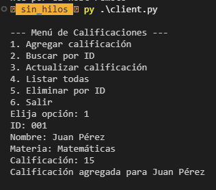

# Sistema de Gestión de Calificaciones - Laboratorio 2

## Descripción General del Proyecto

Sistema distribuido cliente-servidor para la gestión de calificaciones estudiantiles con validación de materias mediante un servicio externo de NRCs (Número de Referencia de Curso). El proyecto implementa dos arquitecturas:

### Componentes del Sistema

#### 1. Servidor de Calificaciones
Servidor TCP que procesa solicitudes de clientes para realizar operaciones CRUD (Crear, Leer, Actualizar, Eliminar) sobre calificaciones estudiantiles almacenadas en un archivo CSV compartido.

**Características:**
- **Puerto**: 12345
- **Protocolo**: TCP/IP con sockets
- **Persistencia**: `calificaciones.csv` (compartido)
- **Formato de comunicación**: Comandos delimitados por `|`, respuestas en JSON

**Implementaciones disponibles:**
- **sin_hilos/**: Servidor secuencial (atiende un cliente a la vez)
- **con_hilos/**: Servidor concurrente con threading (atiende múltiples clientes simultáneamente)

#### 2. Cliente de Calificaciones
Aplicación interactiva con menú que permite a los usuarios realizar operaciones sobre las calificaciones conectándose al servidor de calificaciones.

**Funcionalidades:**
- Agregar calificación (con validación de NRC en versión con hilos)
- Buscar estudiante por ID
- Actualizar calificación
- Listar todas las calificaciones
- Eliminar registro por ID

#### 3. Servidor NRC
Servicio independiente que valida códigos NRC (Número de Referencia de Curso) y retorna información de materias.

**Características:**
- **Puerto**: 12346
- **Protocolo**: TCP/IP con sockets
- **Persistencia**: `nrcs.csv`
- **Función**: Validar que las materias/NRCs existan antes de agregar calificaciones

## Estructura de Directorios

```
laboratorio_2/
├── README.md                  # Documentación del proyecto
├── calificaciones.csv         # Base de datos de calificaciones (compartida)
├── nrcs.csv                   # Base de datos de NRCs/materias
├── nrcs_server.py             # Servidor de validación de NRCs (puerto 12346)
│
├── sin_hilos/                 # Implementación secuencial
│   ├── server.py              # Servidor secuencial (puerto 12345)
│   └── client.py              # Cliente interactivo
│
└── con_hilos/                 # Implementación concurrente
    ├── server.py              # Servidor con threading (puerto 12345)
    └── client.py              # Cliente interactivo con validación NRC
```

## Instalación de Dependencias

Este proyecto utiliza únicamente la biblioteca estándar de Python. No requiere instalación de paquetes externos.

**Requisitos:**
- Python 3.6 o superior
- Módulos estándar: `socket`, `csv`, `json`, `os`, `pathlib`, `threading`

**Verificar instalación de Python:**
```bash
python3 --version
```

## Instrucciones Paso a Paso para Ejecutar

### Opción 1: Implementación Secuencial (sin_hilos)

Esta implementación **NO requiere** el servidor NRC y atiende un cliente a la vez.

#### Terminal 1 - Servidor de Calificaciones (Secuencial)
```bash
cd laboratorio_2/sin_hilos
python3 server.py
```

**Salida esperada:**
```
Servidor secuencial escuchando en puerto 12345...
```

#### Terminal 2 - Cliente
```bash
cd laboratorio_2/sin_hilos
python3 client.py
```

**Salida esperada:**
```
--- Menú de Calificaciones ---
1. Agregar calificación
2. Buscar por ID
3. Actualizar calificación
4. Listar todas
5. Eliminar por ID
6. Salir
Elija opción:
```

---

### Opción 2: Implementación Concurrente (con_hilos)

Esta implementación **REQUIERE** el servidor NRC para validar materias y puede atender múltiples clientes simultáneamente.

#### Terminal 1 - Servidor NRC
```bash
cd laboratorio_2
python3 nrcs_server.py
```

**Salida esperada:**
```
Servidor NRCs escuchando en puerto 12346...
```

#### Terminal 2 - Servidor de Calificaciones (Concurrente)
```bash
cd laboratorio_2/con_hilos
python3 server.py
```

**Salida esperada:**
```
Servidor concurrente escuchando en puerto 12345...
```

#### Terminal 3 - Cliente 1
```bash
cd laboratorio_2/con_hilos
python3 client.py
```

#### Terminal 4 (Opcional) - Cliente 2
```bash
cd laboratorio_2/con_hilos
python3 client.py
```

**Nota:** Puedes abrir múltiples terminales con clientes para probar la concurrencia.

---

### Detener los Servidores

Presionar `Ctrl+C` en cada terminal de servidor para detenerlos de forma segura.

## Ejemplos de Uso

### Ejemplo 1: Agregar Calificación (sin_hilos - Sin validación NRC)

```
Elija opción: 1
ID: 001
Nombre: Juan Pérez
Materia: Matemáticas
Calificación: 95
```

**Respuesta del servidor:**
```json
{"status": "ok", "mensaje": "Calificación agregada para Juan Pérez"}
```

**En Terminal:**


---

### Ejemplo 2: Agregar Calificación con NRC Válido (con_hilos)

**Prerequisito:** El servidor NRC debe estar corriendo y el NRC debe existir en `nrcs.csv`.

**NRCs disponibles por defecto:**
- `MAT101` - Matemáticas
- `FIS201` - Física

```
Elija opción: 1
ID: 002
Nombre: María López
Materia: MAT101
Calificación: 88
```

**Respuesta del servidor:**
```json
{"status": "ok", "mensaje": "Calificación agregada para María López"}
```

---

### Ejemplo 3: Agregar Calificación con NRC Inválido (con_hilos)

```
Elija opción: 1
ID: 003
Nombre: Carlos Ruiz
Materia: INVALID123
Calificación: 90
```

**Respuesta del servidor:**
```json
{"status": "error", "mensaje": "Materia/NRC no válida"}
```

---

### Ejemplo 4: Buscar Estudiante por ID

```
Elija opción: 2
ID: 001
```

**Respuesta:**
```
Nombre: Juan Pérez, Materia: Matemáticas, Calificación: 95
```

---

### Ejemplo 5: Listar Todas las Calificaciones

```
Elija opción: 4
```

**Respuesta:**
```
{'ID_Estudiante': '001', 'Nombre': 'Juan Pérez', 'Materia': 'Matemáticas', 'Calificacion': '95'}
{'ID_Estudiante': '002', 'Nombre': 'María López', 'Materia': 'MAT101', 'Calificacion': '88'}
```

## Cómo Probar Concurrencia

### Prueba 1: Servidor Secuencial (sin_hilos) - Sin Concurrencia

1. Iniciar el servidor secuencial en Terminal 1
2. Abrir dos clientes en Terminal 2 y Terminal 3
3. En Terminal 2, seleccionar opción 4 (Listar todas) - el cliente quedará esperando respuesta
4. Mientras Terminal 2 espera, intentar usar Terminal 3
5. **Resultado esperado:** Terminal 3 no podrá interactuar hasta que Terminal 2 termine

**Observación:** El servidor secuencial bloquea y solo atiende un cliente a la vez.

---

### Prueba 2: Servidor Concurrente (con_hilos) - Con Concurrencia

1. Iniciar el servidor NRC en Terminal 1
2. Iniciar el servidor concurrente en Terminal 2
3. Abrir tres clientes en Terminal 3, 4 y 5
4. En los tres clientes simultáneamente:
   - Cliente 1: Agregar calificación con NRC `MAT101`
   - Cliente 2: Listar todas las calificaciones
   - Cliente 3: Buscar por ID

5. **Resultado esperado:** Los tres clientes son atendidos simultáneamente sin bloqueos

**Observación en logs del servidor:**
```
Cliente conectado desde ('127.0.0.1', 54321) en hilo Thread-1
Cliente conectado desde ('127.0.0.1', 54322) en hilo Thread-2
Cliente conectado desde ('127.0.0.1', 54323) en hilo Thread-3
```

---

### Prueba 3: Validación de NRC

1. Iniciar servidor NRC y servidor concurrente
2. Intentar agregar calificación con NRC inválido: `INVALID999`
3. **Resultado esperado:** Error "Materia/NRC no válida"
4. Intentar agregar calificación con NRC válido: `MAT101`
5. **Resultado esperado:** Éxito "Calificación agregada"

## Limitaciones y Notas

### Limitaciones de la Implementación sin_hilos

- **Sin concurrencia**: Solo atiende un cliente a la vez
- **Sin validación NRC**: Acepta cualquier materia sin validar
- **Bloqueo**: Los clientes deben esperar en cola
- **No escalable**: No adecuado para múltiples usuarios simultáneos

### Limitaciones de la Implementación con_hilos

- **Sin locks en CSV**: Posibles condiciones de carrera al escribir simultáneamente
- **Dependencia del servidor NRC**: Si el servidor NRC no está disponible, no se pueden agregar calificaciones
- **Timeout de 2 segundos**: La consulta al servidor NRC tiene timeout de 2 segundos

### Limitaciones Generales

- **Persistencia en CSV**: No es una base de datos robusta, no tiene transacciones
- **Sin autenticación**: No hay control de acceso ni seguridad
- **Sin encriptación**: Los datos viajan en texto plano
- **Localhost únicamente**: Solo funciona en la misma máquina

---

## Formato de Comunicación

### Comandos del Cliente al Servidor de Calificaciones

Formato: `OPERACION|param1|param2|...`

- `AGREGAR|ID|Nombre|Materia|Calificacion`
- `BUSCAR|ID`
- `ACTUALIZAR|ID|NuevaCalificacion`
- `LISTAR`
- `ELIMINAR|ID`

### Comandos al Servidor NRC

- `BUSCAR NRC|codigo_nrc`
- `LISTAR`

### Formato de Respuestas (JSON)

```json
{
  "status": "ok|error|not_found",
  "mensaje": "Descripción del resultado",
  "data": {}  // Opcional, solo en consultas exitosas
}
```

---

## Archivos de Persistencia

### calificaciones.csv
```csv
ID_Estudiante,Nombre,Materia,Calificacion
123,Cristian Robalino,Distribuidas,20
001,Juan Pérez,MAT101,95
```

### nrcs.csv
```csv
NRC,Materia
MAT101,Matematicas
FIS201,Fisica
```

---

## Autores

- Dennison Chalacan
- Josue Guallichico
- Cristian Robalino
